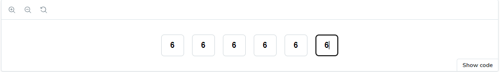

# verify-code-input-react

> React component to insert a code (number, text, password) in a sigle input elements



[](https://www.npmjs.com/package/verify-code-input-react) [](https://standardjs.com)

## Install

```bash
npm i verify-code-input-react
```

or

```bash
yarn add verify-code-input-react
```

or

```bash
pnpm i verify-code-input-react
```

## Usage

1 . Require verify-code-input-react after installation

```js
import { InputCode } from 'verify-code-input-react';
```

2 . Include verify-code-input-react as in the following example

#### use ref

```tsx
import React, { useRef } from 'react';
import { InputCode } from 'verify-code-input-react';

const App = () => {
  const ref = useRef('');

  const handleClick = () => {
    console.log(ref.current.value);
  };

  return (
    <>
      <InputCode ref={ref} fields={6} placeholder='-' type='text' placeholder={'-'} />
      <button onClick={handleClick}>submit</button>
    </>
  );
};
```

#### use onTriggerChange function

```tsx
import React, { useState } from 'react';
import { InputCode } from 'verify-code-input-react';

const App = () => {
  const [value, setValue] = useState<string>('');

  const handleClick = () => {
    console.log(value);
  };

  return (
    <>
      <InputCode
        fields={6}
        onKeyDownInput={() => {}}
        onTriggerChange={setValue}
        placeholder='-'
        type='text'
        placeholder={'-'}
      />
      <button onClick={handleClick}>submit</button>
    </>
  );
};
```

## Props

<table>
  <tr>
    <th>Name<br/></th>
    <th>Type</th>
    <th>Required</th>
    <th>Default</th>
    <th>Description</th>
  </tr>
  <tr>
    <td>type</td>
    <td>string "number" | "text" | "password"</td>
    <td>false</td>
    <td>number</td>
    <td>Allow type on input</td>
  </tr>
  <tr>
    <td>disabled</td>
    <td>boolean</td>
    <td>false</td>
    <td>false</td>
    <td>Controls field disabled</td>
  </tr>
  <tr>
    <td>placeholder</td>
    <td>string</td>
    <td>false</td>
    <td>""</td>
    <td>Placeholder on input</td>
  </tr>
  <tr>
    <td>styles</td>
    <td>CSSProperties</td>
    <td>false</td>
    <td>none</td>
    <td>Styles for input</td>
  </tr>
  <tr>
    <td>containerClassName</td>
    <td>string</td>
    <td>false</td>
    <td>''</td>
    <td>Container class name</td>
  </tr>
    <tr>
     <td>className</td>
     <td>string</td>
     <td>false</td>
     <td>''</td>
     <td>Input class name</td>
   </tr>
  <tr>
    <td>error</td>
    <td>ReactNode</td>
    <td>false</td>
    <td>none</td>
    <td>Error element</td>
  </tr>
  <tr>
    <td>onKeyDownInput</td>
    <td>function ((e: KeyboardEvent<HTMLInputElement>) => void)</td>
    <td>false</td>
    <td>none</td>
    <td>onKeyDownInput events</td>
  </tr>
  <tr>
    <td>onTriggerChange</td>
    <td>function ((value: string) => void)</td>
    <td>false</td>
    <td>none</td>
    <td>Change code handler</td>
  </tr>

</table>

## Contributors

MIT © [StanTran](https://github.com/TranVanDu)
